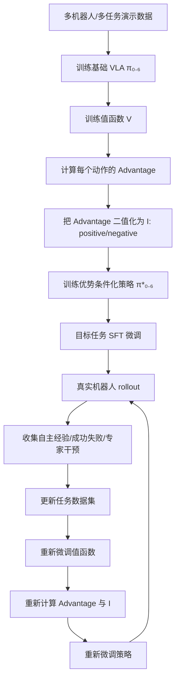

# π₀.₆ / RECAP 工作流与数学推导小白版

> 目标：把 **π₀.₆ 是怎么工作的**、**RECAP 为什么能让 VLA 从经验中变强**、以及论文里的核心数学公式，按照“从直觉到公式再到训练流程”的顺序梳理清楚。  
> 适合背景：已有 SLAM / 导航 / 决策算法基础，刚开始学习 VLA、Flow Matching、机器人 RL。

---

## 0. 一句话总览

π₀.₆ 的核心不是“又做了一个更大的模仿学习模型”，而是：

> **先训练一个会做事的 VLA，再让它自己在真实环境中尝试；用成功/失败训练一个值函数当裁判；再用裁判给每个动作打分，把“好动作”标出来，让 VLA 更偏向好动作。**

这个方法叫 **RECAP**：

> **RL with Experience and Corrections via Advantage-conditioned Policies**  
> 通过“经验 + 纠正 + 优势条件化策略”做强化学习。

可以把它理解成：

```text
普通 BC / 模仿学习：
人类演示 → 模型照着学

π₀.₆ / RECAP：
人类演示 → 初始模型
初始模型自己试错 → 收集成功/失败/人类干预
值函数判断每一步好不好
策略重新训练：多学好动作，少学坏动作
重复迭代 → 更快、更稳、更少失败
```

---

## 1. π₀.₆ 在 VLA 家族里的位置

### 1.1 π₀、π₀.₅、π₀.₆ 的递进关系

| 模型 | 核心方法 | 重点能力 | 主要限制 |
|---|---|---|---|
| π₀ | VLM + Flow Matching 动作专家 | 从视觉语言输入直接输出连续机器人动作 | 主要靠模仿学习，不能有效从失败中改进 |
| π₀.₅ | Co-training / Knowledge Insulation | 泛化到新场景、新家庭、新任务 | 仍主要是 BC / SFT 思路 |
| π₀.₆ | RECAP / Advantage Conditioning / Offline RL | 从真实部署经验中自我改进 | 需要 rollout、成功失败标签、值函数训练 |

所以 π₀.₆ 的关键词是：

```text
VLA + Flow Matching + 值函数 + 优势函数 + 离线 RL + 人类干预 + 迭代训练
```

---

## 2. π₀.₆ 的整体系统工作流

### 2.1 大流程图



### 2.2 分阶段解释

#### 阶段 A：预训练基础 VLA

输入数据包括：

- 多机器人平台的机器人数据；
- 图像、语言、动作序列；
- 网络视觉语言数据；
- 子任务文本标注；
- 连续动作和部分离散动作。

基础 VLA 学到：

```text
看图像 + 读任务指令 + 读机器人状态 → 预测下一段动作
```

形式上：

$$
\pi_\theta(a_{t:t+H}, \hat{\ell} \mid o_t, \ell)
$$

含义：

| 符号 | 含义 |
|---|---|
| $o_t$ | 当前观测，包括多相机图像、关节状态、机器人状态 |
| $\ell$ | 语言任务，例如“fold the shirt” |
| $\hat{\ell}$ | 模型预测的下一子任务，例如“grasp left sleeve” |
| $a_{t:t+H}$ | 从当前时刻开始的一段动作 chunk |
| $H$ | action horizon，动作块长度 |

---

#### 阶段 B：训练值函数

值函数就是一个“裁判”：

```text
给定当前图像、机器人状态、任务语言 → 判断现在离成功还有多远
```

它不是直接输出动作，而是输出当前状态的价值：

$$
V^{\pi_{ref}}(o_t, \ell)
$$

直观上：

```text
V 越大：当前状态越好，越接近成功
V 越小：当前状态越差，可能离失败很近
```

π₀.₆ 里用的是“负剩余步数”设计：

```text
快成功：V 接近 0
还要很多步：V 是负数
失败：V 是很大的负数
```

---

#### 阶段 C：用值函数计算 Advantage

优势函数回答的问题是：

> 当前状态下，刚才这个动作比平均动作好多少？

公式是：

$$
A^{\pi_{ref}}(o_t, a_t, \ell)
=
\sum_{t'=t}^{t+N-1} r_{t'}
+
V^{\pi_{ref}}(o_{t+N}, \ell)
-
V^{\pi_{ref}}(o_t, \ell)
$$

拆开看：

| 项 | 含义 |
|---|---|
| $V(o_t, \ell)$ | 做动作前，当前状态的价值 |
| $\sum r_{t'}$ | 接下来 N 步真实拿到的奖励 |
| $V(o_{t+N}, \ell)$ | 做完 N 步后，新状态的价值 |
| $A(o_t,a_t,\ell)$ | 这个动作带来的价值变化是否超出预期 |

通俗版：

```text
Advantage = 做完这个动作后的实际表现 - 原本对当前状态的预期
```

如果：

```text
A > 0：这个动作比平均好
A = 0：这个动作差不多正常
A < 0：这个动作拖后腿
```

---

#### 阶段 D：把 Advantage 变成 positive / negative 标签

π₀.₆ 不直接把连续 advantage 数字塞给模型，而是做二值化：

$$
I_t = \mathbf{1}\left[A^{\pi_{ref}}(o_t,a_t,\ell) > \varepsilon_\ell\right]
$$

含义：

```text
如果 advantage 超过阈值 εℓ：I_t = True，也就是 positive
否则：I_t = False，也就是 negative
```

其中 $\varepsilon_\ell$ 是任务相关阈值。

论文中大致做法：

| 阶段 | 阈值选择 |
|---|---|
| 预训练 | 每个任务 advantage/value 分布的约 30% 分位 |
| 微调 | 更严格，约 40% 分位 |

直观理解：

```text
不是所有成功轨迹里的动作都一定好；
也不是所有失败轨迹里的动作都一定坏；
RECAP 关心的是每一步动作有没有让状态变得更好。
```

---

#### 阶段 E：训练优势条件化策略

模型输入中额外加入一个文本 token：

```text
Advantage: positive
```

或：

```text
Advantage: negative
```

于是策略变成：

$$
\pi_\theta(a_t \mid I_t, o_t, \ell)
$$

也就是说，模型不仅知道：

```text
当前图像是什么，任务是什么
```

还知道：

```text
这条训练样本里的动作是 positive 还是 negative
```

训练后推理时，我们通常给模型 positive 条件：

```text
请像那些 advantage positive 的动作一样行动
```

---

## 3. 从标准 RL 到 RECAP 的数学推导

这一部分按“为什么需要值函数 → 为什么需要 advantage → 为什么 advantage conditioning 能改进策略”的顺序讲。

---

## 3.1 标准强化学习目标

机器人执行一个任务，会产生一条轨迹：

$$
\tau = (o_0, a_0, o_1, a_1, \dots, o_T)
$$

轨迹概率为：

$$
\rho_\pi(\tau)
=
p(o_0)
\prod_{t=0}^{T-1}
\pi(a_t \mid o_t)
p(o_{t+1} \mid o_t, a_t)
$$

逐项解释：

| 符号 | 含义 |
|---|---|
| $p(o_0)$ | 初始场景出现的概率 |
| $\pi(a_t \mid o_t)$ | 策略在当前观测下选动作的概率 |
| $p(o_{t+1}\mid o_t,a_t)$ | 环境动力学，执行动作后变成下个状态的概率 |
| $\prod$ | 每一步概率连乘 |

强化学习目标是最大化期望回报：

$$
J(\pi)=\mathbb{E}_{\tau\sim\rho_\pi}\left[\sum_{t=0}^{T}r_t\right]
$$

通俗版：

```text
让机器人执行很多次任务，平均拿到的总奖励越高越好。
```

---

## 3.2 值函数 V：现在这个状态有多好

值函数定义为：

$$
V^\pi(o_t)
=
\mathbb{E}\left[\sum_{t'=t}^{T}r_{t'}\right]
$$

含义：

```text
如果我现在在状态 o_t，之后继续按照策略 π 执行，预计还能拿多少奖励？
```

在 π₀.₆ 里，因为奖励主要是负步数，所以：

```text
V(o_t) ≈ -从当前状态到成功还需要的步数
```

例如：

| 状态 | 预计还要几步成功 | V 值大概 |
|---|---:|---:|
| 已经快折好衣服 | 10 步 | -10 |
| 刚拿起衣服 | 80 步 | -80 |
| 衣服掉地上 | 失败惩罚 | -200 或更小 |

所以 V 越接近 0，越好。

---

## 3.3 奖励设计：为什么是“负步数”

论文里的通用奖励：

$$
r_t =
\begin{cases}
0, & t=T \text{ 且任务成功} \\
-C_{fail}, & t=T \text{ 且任务失败} \\
-1, & \text{其他时间步}
\end{cases}
$$

也就是：

```text
每多执行一步：扣 1 分
最后成功：不额外扣分
最后失败：扣一个很大的失败惩罚
```

### 为什么这样设计？

#### 1. 成功比失败好

失败轨迹最后有 $-C_{fail}$，所以失败的总回报很低。

#### 2. 快成功比慢成功好

如果两条轨迹都成功：

```text
轨迹 A：50 步成功，总奖励约 -50
轨迹 B：100 步成功，总奖励约 -100
```

因为 $-50 > -100$，所以 A 更好。

#### 3. 不需要人工设计复杂 reward

对于真实机器人任务，手写 dense reward 很难：

```text
衣服折叠到什么程度算 +0.3？
咖啡粉压实到什么程度算 +0.5？
纸箱折角偏了多少算 -0.2？
```

π₀.₆ 避开这个问题，只需要 episode 级别标签：

```text
成功 / 失败
```

---

## 3.4 Advantage：这个动作有没有让局面变好

优势函数：

$$
A^\pi(o_t,a_t)
=
\left(\sum_{t'=t}^{t+N-1}r_{t'} + V^\pi(o_{t+N})\right)
-
V^\pi(o_t)
$$

可以记成：

$$
A = \text{动作后的实际效果} - \text{动作前的预期效果}
$$

举例：

假设当前状态价值：

$$
V(o_t)=-80
$$

也就是说，裁判认为现在大概还要 80 步成功。

执行一个动作后，过了 N 步，新状态价值变成：

$$
V(o_{t+N})=-60
$$

中间每步扣分，假设 N=5：

$$
\sum r = -5
$$

那么：

$$
A = -5 + (-60) - (-80) = 15
$$

这说明：

```text
本来预计还要 80 步，做完这个动作链后，扣了 5 分，但状态变成只要 60 步就能成功。
净收益 = +15，是好动作。
```

反过来，如果新状态变成：

$$
V(o_{t+N})=-90
$$

则：

$$
A = -5 + (-90) - (-80) = -15
$$

说明：

```text
动作让状态变差了，是坏动作。
```

---

## 3.5 正则化 RL：为什么不能直接疯狂追高 Advantage

如果只看 reward，策略可能会走得太激进，偏离数据分布。真实机器人上这很危险：

```text
模型可能尝试训练数据里几乎没见过的动作；
动作看似能提高 reward，但真实执行可能崩；
Flow Matching / 大模型训练也容易不稳定。
```

所以引入参考策略 $\pi_{ref}$，约束新策略不要离旧策略太远：

$$
J(\pi,\pi_{ref})
=
\mathbb{E}\left[\sum_t \gamma^t r_t\right]
-
\beta\,\mathbb{E}\left[D\left(\pi(\cdot|o)\|\pi_{ref}(\cdot|o)\right)\right]
$$

其中：

| 项 | 含义 |
|---|---|
| 第一项 | 希望奖励更高 |
| 第二项 | 惩罚新策略偏离参考策略 |
| $D$ | 两个策略分布的距离，通常是 KL 散度 |
| $\beta$ | 控制保守程度 |

如果 $D$ 是 KL 散度，最优策略有经典形式：

$$
\hat{\pi}(a|o)
\propto
\pi_{ref}(a|o)\exp\left(\frac{A^{\pi_{ref}}(o,a)}{\beta}\right)
$$

这句话非常重要。

它的意思是：

```text
新策略 = 旧策略 × advantage 权重
```

如果某个动作 advantage 高：

$$
\exp(A/\beta)
$$

就大，新策略会更偏向它。

如果某个动作 advantage 低：

$$
\exp(A/\beta)
$$

就小，新策略会降低它的概率。

---

## 3.6 RECAP 的关键转化：把 RL 变成监督学习

直接训练：

$$
\hat{\pi}(a|o)
\propto
\pi_{ref}(a|o)\exp(A/\beta)
$$

对大 VLA 不方便，因为：

- Flow Matching 不容易精确算动作 log-prob；
- PPO / REINFORCE 这类策略梯度不稳定；
- 真机交互成本高；
- 数据来自演示、旧策略、新策略、人类干预，分布很杂。

RECAP 换了一个思路：

```text
不直接用 exp(A/β) 做策略梯度，
而是把 advantage 变成一个条件 I，
让模型学：在 positive 条件下应该输出什么动作。
```

---

## 3.7 Bayes 推导：为什么 positive 条件能表示改进策略

定义一个改进指示器 $I$：

```text
I = positive 表示这个动作是高 advantage 动作
```

我们想要：

$$
\pi(a|I,o)
$$

也就是：

```text
在当前观测 o 下，如果要求动作是 positive，那么动作 a 的概率是多少？
```

由 Bayes 公式：

$$
p(I|a,o)
=
\frac{p(a|I,o)p(I|o)}{p(a|o)}
$$

在固定 $o$ 时，$p(I|o)$ 对动作 $a$ 来说是常数，可以吸收到比例符号里：

$$
p(I|a,o)
\propto
\frac{p(a|I,o)}{p(a|o)}
$$

把它放进策略改进公式：

$$
\hat{\pi}(a|o)
\propto
\pi_{ref}(a|o)
\left[\frac{\pi_{ref}(a|I,o)}{\pi_{ref}(a|o)}\right]^\beta
$$

加入语言任务 $\ell$：

$$
\hat{\pi}(a|o,\ell)
\propto
\pi_{ref}(a|o,\ell)
\left[
\frac{\pi_{ref}(a|I,o,\ell)}{\pi_{ref}(a|o,\ell)}
\right]^\beta
$$

### 特别重要的情况：$\beta=1$

当 $\beta=1$ 时：

$$
\hat{\pi}(a|o,\ell)
\propto
\pi_{ref}(a|I,o,\ell)
$$

所以可以直观理解为：

```text
如果训练出了“positive 条件策略”，
那么推理时直接给 positive 条件，
就近似得到改进策略。
```

这就是 RECAP 的数学核心。

---

## 3.8 最终训练目标

论文里的训练目标：

$$
\min_\theta
\mathbb{E}_{D_{\pi_{ref}}}
\left[
-\log \pi_\theta(a_t|o_t,\ell)
-
\alpha \log \pi_\theta(a_t|I_t,o_t,\ell)
\right]
$$

其中：

$$
I_t = \mathbf{1}\left[A^{\pi_{ref}}(o_t,a_t,\ell)>\varepsilon_\ell\right]
$$

分开解释：

### 第一项：普通模仿学习

$$
-\log \pi_\theta(a_t|o_t,\ell)
$$

含义：

```text
不管样本好坏，都学一点，保持基本行为能力。
```

它让模型不至于忘掉“怎么动”“任务大概怎么做”。

### 第二项：优势条件化学习

$$
-\alpha \log \pi_\theta(a_t|I_t,o_t,\ell)
$$

含义：

```text
告诉模型：这个动作是在 positive 还是 negative 条件下出现的。
训练后，推理时我们只给 positive 条件，让模型偏向好动作。
```

### 为什么两项都要有？

如果只有第一项：

```text
就是普通 BC，坏动作也会被模仿。
```

如果只有第二项：

```text
模型可能过度依赖标签，基本分布不稳定。
```

两项结合：

```text
既保留原始能力，又能朝更优方向偏移。
```

---

## 4. 分布式值函数：为什么不是直接输出一个 V

π₀.₆ 的值函数不是直接输出一个数字，而是输出一个值分布：

$$
p_\phi(V|o_t,\ell)
$$

比如有 $B=201$ 个桶：

```text
桶 0：很差
桶 1：比较差
...
桶 200：接近成功
```

训练目标：

$$
\min_\phi
\mathbb{E}_{\tau\in D}
\left[
\sum_{o_t\in\tau}
H\left(R_t^B(\tau),p_\phi(V|o_t,\ell)\right)
\right]
$$

解释：

| 符号 | 含义 |
|---|---|
| $R_t(\tau)$ | 从 t 时刻到 episode 结束的真实回报 |
| $R_t^B(\tau)$ | 把真实回报离散到某个桶 |
| $p_\phi(V|o_t,\ell)$ | 值函数预测每个桶的概率 |
| $H$ | 交叉熵损失 |

这和分类任务一样：

```text
真实答案：这个状态的回报属于第 87 个桶
模型输出：201 个桶的概率
交叉熵：让模型给第 87 个桶更高概率
```

训练完后，把分布还原成标量 V：

$$
V^{\pi_{ref}}(o_t,\ell)
=
\sum_{b=1}^{B}p_\phi(V=b|o_t,\ell)\,v(b)
$$

其中 $v(b)$ 是第 b 个桶对应的数值。

通俗版：

```text
最终 V = 每个可能价值 × 该价值的概率，然后加起来
```

例如：

```text
30% 概率 V=-20
50% 概率 V=-30
20% 概率 V=-50

期望 V = 0.3×(-20)+0.5×(-30)+0.2×(-50) = -31
```

---

## 5. π₀.₆ 的模型输出如何训练

π₀.₆ 同时输出几类东西：

1. 子任务文本；
2. 离散动作 token；
3. 连续动作 chunk。

可以写成：

$$
\log \pi_\theta(a_{t:t+H}, a^{\ell}_{t:t+H}, \hat{\ell}|o_t,\ell)
=
\log \pi_\theta(\hat{\ell}|o_t,\ell)
+
\log \pi_\theta(a^{\ell}_{t:t+H}|o_t,\ell,\hat{\ell})
+
\log \pi_\theta(a_{t:t+H}|o_t,\ell,\hat{\ell})
$$

解释：

| 部分 | 作用 |
|---|---|
| $\hat{\ell}$ | 中间子任务文本，例如“拿起杯子” |
| $a^\ell$ | 离散化动作 token，例如 FAST 动作表示 |
| $a$ | 连续机器人动作，例如关节角、末端速度、夹爪命令 |

---

## 6. Flow Matching 在动作预测中的角色

### 6.1 为什么需要 Flow Matching

机器人动作是连续值：

```text
关节角度、末端位姿、夹爪开合、速度命令……
```

这类动作不是普通分类问题，不能简单用 softmax 输出。

Flow Matching 的思路是：

```text
从随机噪声出发，学习一条“流”，逐步把噪声变成真实动作。
```

类似 diffusion，但训练目标常写成速度场匹配。

---

### 6.2 Flow Matching 的核心公式

论文里连续动作似然下界大致写成：

$$
\log \pi_\theta(a_{t:t+H},a^\ell_{t:t+H}|I_t,o_t,\ell,\hat{\ell})
\ge
\mathbb{E}_{\eta,\omega}
\left[
\log p_\theta(a^\ell|I_t,o_t,\ell,\hat{\ell})
-
\alpha_\eta
\left\|
\omega-a-f_\theta(a^{\eta,\omega},I_t,o_t,\ell,\hat{\ell})
\right\|^2
\right]
$$

其中：

$$
a^{\eta,\omega}=\eta a+(1-\eta)\omega
$$

解释：

| 符号 | 含义 |
|---|---|
| $a$ | 真实动作 |
| $\omega$ | 高斯噪声，$\omega\sim\mathcal{N}(0,I)$ |
| $\eta$ | 插值时间，范围 0 到 1 |
| $a^{\eta,\omega}$ | 噪声和真实动作之间的中间点 |
| $f_\theta$ | 模型预测的速度场 / 去噪方向 |
| $\alpha_\eta$ | 不同噪声阶段的损失权重 |

### 6.3 小白解释

可以把真实动作 $a$ 看作终点，噪声 $\omega$ 看作起点。

中间点：

$$
a^{\eta,\omega}=\eta a+(1-\eta)\omega
$$

当：

```text
η = 0：a^{η,ω} = ω，是纯噪声
η = 1：a^{η,ω} = a，是真实动作
η = 0.5：一半噪声，一半真实动作
```

模型要学的是：

```text
在中间点，应该往哪个方向走，才能从噪声走到真实动作？
```

目标方向大致是：

$$
a - \omega
$$

论文公式里写成 $\omega-a-f_\theta(...)$，符号方向可能取决于具体定义，本质都是：

```text
让模型预测的速度场接近真实的噪声→动作方向。
```

---

## 7. CFG：推理时怎么更偏向 positive 动作

训练时，π₀.₆ 会随机丢掉 advantage 条件，例如 30% 概率不给模型看 I。

这样模型同时学会两个分布：

```text
无条件策略：π(a|o,ℓ)
有条件策略：π(a|I,o,ℓ)
```

推理时，可以用类似 Classifier-Free Guidance 的方式放大 positive 条件影响。

直观写法：

$$
\text{guided score}
=
\text{uncond score}
+
\beta\left(\text{positive score}-\text{uncond score}\right)
$$

当：

| β | 效果 |
|---|---|
| β = 0 | 基本不使用 positive 条件 |
| β = 1 | 正常使用 positive 条件 |
| β > 1 | 更激进地朝 positive 动作靠近 |

直观版：

```text
β 越大，模型越“相信好动作标签”；
β 太大，也可能动作过于激进。
```

---

## 8. RECAP 完整算法逐步拆解

### 8.1 预训练阶段

```text
输入：大规模多任务机器人数据 D_demo
```

#### Step 1：训练值函数

用演示数据计算每个状态的回报，训练：

$$
p_\phi(V|o_t,\ell)
$$

让它学会判断：

```text
这个状态距离成功还有多远？
```

#### Step 2：计算 advantage

对数据里每一步：

$$
A_t = \sum r + V(o_{t+N}) - V(o_t)
$$

#### Step 3：生成 positive / negative 标签

$$
I_t=\mathbf{1}[A_t>\varepsilon_\ell]
$$

#### Step 4：训练优势条件化 VLA

训练：

$$
\pi_\theta(a_t|I_t,o_t,\ell)
$$

得到：

```text
π*₀.₆：会根据 positive/negative 条件输出动作的 VLA
```

---

### 8.2 目标任务适配阶段

假设目标任务是：

```text
折叠某类衣服 / 做咖啡 / 组装纸箱 / G1 pick apple
```

#### Step 1：收集少量演示

得到任务数据：

$$
D_\ell^{demo}
$$

#### Step 2：SFT 微调策略

这一步通常把：

```text
I_t = True
```

也就是：

```text
先假设人类演示都是好动作，让模型学会任务基本流程。
```

得到初始策略：

$$
\pi_\ell^0
$$

---

### 8.3 真实机器人 rollout 阶段

让机器人用当前策略执行任务：

$$
\pi_\ell^{k-1}
$$

收集数据：

```text
观测 o_t
模型动作 a_t
是否成功
执行时间
是否有人类干预
人类纠正动作
失败类型
```

数据来源包括：

| 数据类型 | 作用 |
|---|---|
| 人类演示 | 提供基本技能 |
| 自主成功轨迹 | 学更快、更自然的完成方式 |
| 自主失败轨迹 | 告诉值函数哪些状态/动作不好 |
| 专家干预 | 修复灾难性错误，提供恢复动作 |

---

### 8.4 更新值函数

把新数据加入任务数据集：

$$
D_\ell \leftarrow D_\ell \cup D_{rollout}
$$

重新训练 / 微调值函数：

$$
V_\ell^k
$$

它现在能更准确判断目标任务中的状态好坏。

---

### 8.5 更新策略

用新的值函数重新计算 advantage：

$$
A_t^k = \sum r + V_\ell^k(o_{t+N}) - V_\ell^k(o_t)
$$

再生成：

$$
I_t^k=\mathbf{1}[A_t^k>\varepsilon_\ell]
$$

然后重新训练策略：

$$
\pi_\ell^k
$$

论文里一个重要工程选择是：

```text
每轮值函数和策略都从预训练 checkpoint 微调，
而不是直接从上一轮 checkpoint 继续训。
```

原因：

```text
减少多轮迭代导致的分布漂移和灾难性遗忘。
```

---

## 9. 一个完整例子：折衣服任务

假设任务：

```text
fold the orange T-shirt
```

### 9.1 一条轨迹

```text
0. 看到衣服摊在桌上
1. 机械臂伸向袖子
2. 抓住袖子
3. 拉平衣服
4. 折左边
5. 折右边
6. 放到目标区域
7. 成功
```

每步 reward：

```text
前面每步 -1
成功最后 0
```

如果 80 步成功：

$$
R_0 \approx -80
$$

如果另一个策略 50 步成功：

$$
R_0 \approx -50
$$

所以 50 步成功更好。

### 9.2 某个动作的 advantage

当前状态：衣服有点皱，但可操作。

值函数预测：

$$
V(o_t)=-70
$$

动作 A：正确抓住袖子并拉平。

5 步后：

$$
V(o_{t+5})=-50
$$

中间扣 5 分：

$$
A=-5+(-50)-(-70)=15
$$

positive。

动作 B：抓偏了，衣服被拖到桌边。

5 步后：

$$
V(o_{t+5})=-90
$$

则：

$$
A=-5+(-90)-(-70)=-25
$$

negative。

训练后，模型会知道：

```text
在类似状态下，positive 条件更对应“抓袖子并拉平”；
negative 条件可能对应“抓偏、拖乱”等动作。
```

推理时只给：

```text
Advantage: positive
```

于是模型更倾向做前者。

---

## 10. 和传统 SLAM / 导航 / 决策的类比

你已有 SLAM 和导航决策基础，可以这样类比。

### 10.1 SLAM / Navigation 里的结构

```text
感知 → 定位建图 → 规划 → 控制
```

通常是显式模块：

| 模块 | 输出 |
|---|---|
| SLAM | 位姿、地图 |
| global planner | 全局路径 |
| local planner | 局部轨迹 |
| controller | 速度/控制量 |

### 10.2 VLA 里的结构

```text
图像 + 语言 + 状态 → 大模型隐表示 → 动作 chunk
```

很多中间结构不显式出现。

| 传统机器人 | VLA 对应物 |
|---|---|
| 语义地图 | VLM 的视觉语义表征 |
| 任务规划 | 子任务文本 / latent reasoning |
| 局部规划 | Action Expert / Flow Matching |
| 控制输出 | action chunk |
| cost-to-go | 值函数 V |
| trajectory optimization | advantage-conditioned policy extraction |

### 10.3 Advantage 和导航 cost 的类比

在导航里你可能熟悉：

```text
cost-to-go 越小越好
```

在 π₀.₆ 里：

```text
V ≈ -cost-to-go
```

也就是：

```text
离成功越近，cost 越小，V 越接近 0，价值越高。
```

Advantage 类似：

```text
执行一个动作后，cost-to-go 有没有下降得比预期更多？
```

如果下降很多：

```text
positive action
```

如果没下降甚至变大：

```text
negative action
```

---

## 11. π₀.₆ 为什么比纯 BC 更强

### 11.1 纯 BC 的问题

纯模仿学习目标：

$$
\min_\theta -\log\pi_\theta(a_t|o_t,\ell)
$$

问题：

```text
只会模仿数据里的动作；
成功轨迹里的低效动作也会被学；
失败恢复能力差；
自己 rollout 后遇到非演示状态容易崩；
很难超过演示者表现。
```

### 11.2 RECAP 的改进

RECAP 多了：

```text
成功/失败标签 → 值函数 → advantage → positive/negative → 条件策略
```

它能做到：

| 能力 | 原因 |
|---|---|
| 利用失败数据 | 失败数据训练值函数，告诉模型哪些状态差 |
| 利用干预数据 | 人类纠正强制 positive，提供恢复动作 |
| 提高速度 | 负步数 reward 鼓励更短时间完成 |
| 提高鲁棒性 | rollout 覆盖模型自己会遇到的状态 |
| 训练稳定 | 不直接 PPO，而是转成监督学习 |

---

## 12. 代码实现时应该对应哪些模块

结合 openpi / pi0.6 代码，你可以按以下模块理解。

### 12.1 数据侧

需要关心：

```text
LeRobot 数据格式
episode / frame 结构
observation keys
image keys
state keys
action keys
language task 字段
success/failure 标签
intervention 标签
recap_labels.jsonl
lerobot_fields.npz
```

核心问题：

```text
每一帧能不能拿到：
o_t, a_t, task, episode_id, frame_index, success/failure, intervention?
```

---

### 12.2 Label 生成侧

对应 RECAP 的：

```text
奖励计算
return 计算
value proxy / value model
advantage 计算
I_t 标签生成
```

你需要弄清楚：

```text
r_t 怎么定义？
R_t 怎么从 episode 标签反推？
V(o_t) 是真实模型预测，还是先用 progress proxy？
εℓ 怎么取？
positive/negative 比例是否合理？
```

---

### 12.3 训练侧

对应：

```text
普通 SFT loss
RECAP conditional loss
Flow Matching loss
action chunk loss
是否把 recap_label 注入 prompt / observation
```

你需要检查：

```text
训练 batch 里有没有 recap condition？
positive/negative 是怎么编码的？
loss 有没有只包 flow matching，还是也覆盖 FAST / discrete token？
```

---

### 12.4 rollout 侧

完整 paper-level RECAP 需要：

```text
真实机器人环境接口
reset()
step(action)
success()
episode recorder
human intervention
safety limits
emergency stop
自动/人工成功失败标注
```

这是和普通离线训练最大的区别。

---

## 13. 你作为 VLA 新手最该补的知识路线

你已有 SLAM / 导航 / 决策基础，所以不需要从“机器人是什么”开始，而应该补以下几块。

### 13.1 第一层：VLA 基础概念

必须掌握：

- VLM 如何编码图像和语言；
- robot state 如何并入模型；
- action chunking 是什么；
- 为什么不一步一步输出动作，而是输出一段动作；
- policy head / action expert 的作用；
- LeRobot 数据格式。

建议问题：

```text
一个训练 sample 到底长什么样？
图像、语言、状态、动作在 tensor 里是什么 shape？
模型一次预测多少步动作？
动作是 joint space 还是 end-effector space？
```

---

### 13.2 第二层：Diffusion / Flow Matching Policy

必须掌握：

- diffusion policy 的基本思想；
- Flow Matching 与 diffusion 的关系；
- 噪声 $\omega$、时间 $\eta$、真实动作 $a$ 的插值；
- 为什么训练速度场；
- 推理时如何从噪声生成动作；
- action normalization 对训练的重要性。

你要能说清楚：

```text
为什么连续机器人动作不能只用普通 MSE？
Flow Matching 的输入输出分别是什么？
训练时和推理时有什么区别？
```

---

### 13.3 第三层：离线 RL 和 Advantage

必须掌握：

- reward / return / value / advantage；
- offline RL 和 online RL 区别；
- 为什么真机更适合 batch offline iteration；
- behavior policy / reference policy；
- 为什么需要 KL / regularization；
- AWR、PPO、RECAP 的差异。

重点不是把 PPO 推导背下来，而是理解：

```text
为什么 π₀.₆ 不直接用 PPO？
为什么 advantage conditioning 更适合大型 VLA？
```

---

### 13.4 第四层：真实机器人数据闭环

必须掌握：

- rollout 数据如何记录；
- success/failure 如何标注；
- human intervention 如何写入数据；
- safety layer 如何保护机器人；
- 数据分布漂移如何处理；
- eval 指标如何设计。

这部分对你很重要，因为你有导航系统经验，应该容易理解：

```text
离线模型再强，没有稳定的数据闭环，就不能真正变强。
```

---

## 14. 最后用 12 句话记住 π₀.₆

1. π₀.₆ 是一个 VLA，不只是视觉模型，也不只是控制器。
2. 它输入图像、语言、机器人状态，输出动作 chunk。
3. 它相比 π₀.₅ 升级了 backbone 和 action expert。
4. π₀.₆ 的核心贡献是 RECAP。
5. RECAP 让 VLA 从真实部署经验中学习。
6. 它先用成功/失败定义稀疏 reward。
7. reward 被转换成 return。
8. return 用来训练值函数 V。
9. V 用来计算每个动作的 advantage。
10. advantage 被二值化成 positive / negative。
11. VLA 被训练成 advantage-conditioned policy。
12. 推理时给 positive 条件，模型就更偏向高价值动作。

---

## 15. 核心公式速查

| 公式 | 直观含义 |
|---|---|
| $\rho_\pi(\tau)=p(o_0)\prod_t\pi(a_t|o_t)p(o_{t+1}|o_t,a_t)$ | 策略产生整条轨迹的概率 |
| $J(\pi)=\mathbb{E}[\sum_t r_t]$ | RL 目标：最大化平均总奖励 |
| $V^\pi(o_t)=\mathbb{E}[\sum_{t'=t}^{T}r_{t'}]$ | 当前状态未来能拿多少奖励 |
| $A=\sum r+V(o_{t+N})-V(o_t)$ | 动作是否让局面变得比预期更好 |
| $r_t=0/-C_{fail}/-1$ | 成功、失败、进行中的通用奖励 |
| $I_t=\mathbf{1}[A_t>\varepsilon_\ell]$ | 把 advantage 变成 positive/negative |
| $\hat{\pi}\propto\pi_{ref}\exp(A/\beta)$ | 高 advantage 动作概率变大 |
| $\hat{\pi}\propto\pi_{ref}\left[\frac{\pi(a|I,o)}{\pi(a|o)}\right]^\beta$ | 用 advantage condition 表示改进策略 |
| $\min -\log\pi(a|o)-\alpha\log\pi(a|I,o)$ | RECAP 的监督式训练目标 |
| $a^{\eta,\omega}=\eta a+(1-\eta)\omega$ | Flow Matching 中噪声到动作的插值点 |

---

## 16. 推荐阅读顺序

如果你要继续深入，建议按这个顺序看：

1. `paper_pi_/pi06_.md`：先看已有中文总结；
2. `paper_pi_/pi06_论文中文翻译.md`：逐段看论文细节；
3. `pi_0.6_robot/TODO_RECAP.md`：看当前代码离 paper-level RECAP 还差什么；
4. `pi_0.6_robot/scripts/label_recap_advantage.py`：看 advantage label 怎么生成；
5. `pi_0.6_robot/scripts/recap_train.py`：看 RECAP pipeline 当前串联方式；
6. `pi_0.6_robot/src/openpi/`：看模型、训练 config、policy 结构。

---

## 16.5 一个关键讨论：RECAP 真的在"探索"吗？

> 引入 RL 的核心意义之一，就是让策略能够**犯错、尝试演示数据里从未出现过的动作**，甚至发现比人类更优的解法。这一点 BC / 纯 SFT 做不到。那 RECAP 做到了吗？

### 16.5.1 RECAP 里探索来自哪

RECAP 确实有探索，但它是**隐式、被动**的，来自两个地方：

1. **Flow Matching 采样的随机性**  
   每次推理都从随机噪声 $\omega\sim\mathcal{N}(0,I)$ 出发，加上采样温度，每次 rollout 产生的动作轨迹都不完全一样。这相当于在动作空间里做了轻微的随机扰动。

2. **自主 rollout 必然遇到新状态**  
   模型在真机上执行时，因为自身会犯错、场景本身有随机性，一定会走到演示数据里没见过的状态。在这些新状态下模型给出的动作，本身就是一种探索。

```text
BC：只在演示分布内学习，遇到没见过的状态就崩
RECAP：rollout 会主动进入没见过的状态，并把结果（成功/失败）反馈回训练
```

### 16.5.2 RECAP 探索的真实局限

你的直觉是对的，论文 Discussion 部分也**明确承认**了这一点：

> 探索方式相对 naive，主要依赖策略自身的随机性和人类干预来发现新解法。

这意味着 RECAP 的探索有前提：

| 场景 | RECAP 够不够 |
|---|---|
| 初始 BC 策略已经能到 60%+ 成功率 | 够：rollout 随机性 + 干预足以覆盖边缘情况 |
| 初始策略基本不会做这个任务 | 不够：策略连探索的起点都没有 |
| 需要发现人类从未演示过的创新解法 | 不够：数据分布始终被拉在演示附近 |

根本原因在数学上也能看出来：RECAP 的最优策略是

$$
\hat{\pi}\propto\pi_{ref}\exp(A/\beta)
$$

它是在 $\pi_{ref}$（演示 + 旧策略混合）**附近**做重加权，KL 约束 $\beta$ 明确限制了不能离参考策略太远。所以它擅长"把已有行为调得更好、更快、更稳"，但**不擅长从零发现全新技能**。

### 16.5.3 为什么 RECAP 选择这条保守路线

这是工程上的**主动妥协**，不是没意识到探索的价值：

```text
真机上大范围随机探索：
- 代价高（每次尝试都要重置环境）
- 危险（乱动可能损坏机器人或环境）
- 慢（真机采样远慢于仿真）
- 需要人一直在旁边看着
```

所以 RECAP 只解决了一个子问题：

> **如何从有限的、带成功/失败标签的真实经验中，稳定地把策略提升上去。**

完整的"主动探索、发现全新动作"问题，被论文明确列为未来工作。

### 16.5.4 想要真正的探索，还需要什么

如果目标是"让模型大胆犯错、发现全新解法"，需要补充：

| 方向 | 作用 |
|---|---|
| 主动探索策略（intrinsic motivation、好奇心奖励） | 鼓励访问没见过的状态，而不只靠随机噪声 |
| Online RL | 和环境持续交互，实时更新，而不是批量离线迭代 |
| 课程学习 Curriculum | 从简单任务起步，让探索循序渐进、有意义 |
| Sim-to-Real | 在仿真里大量、安全地探索，再迁移真机 |
| 更大的 $\beta$ / CFG 引导 | 在一定范围内推动策略偏离参考分布（RECAP 已部分做了） |

### 16.5.5 一句话总结这个张力

```text
RL 的理想：让策略自由犯错、探索、超越人类演示。
RECAP 的现实：在真机安全和成本约束下，
              用"演示附近的重加权 + 有限 rollout + 人类干预"
              换取稳定、可落地的持续提升。

它牺牲了一部分探索的自由度，换来了工程上的可用性。
真正的大范围探索，是 VLA + RL 的下一个前沿。
```

---

## 17. 最简 mental model


最后，把 π₀.₆ 记成下面这个闭环：

```text
VLA 做任务
   ↓
真实世界给成功/失败
   ↓
值函数学会判断状态好坏
   ↓
Advantage 判断每个动作有没有贡献
   ↓
动作被标成 positive / negative
   ↓
VLA 学会在 positive 条件下行动
   ↓
下一轮 rollout 更稳、更快
```

这就是 π₀.₆ / RECAP 的核心工作流。
