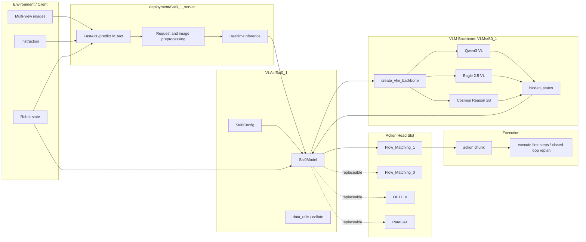
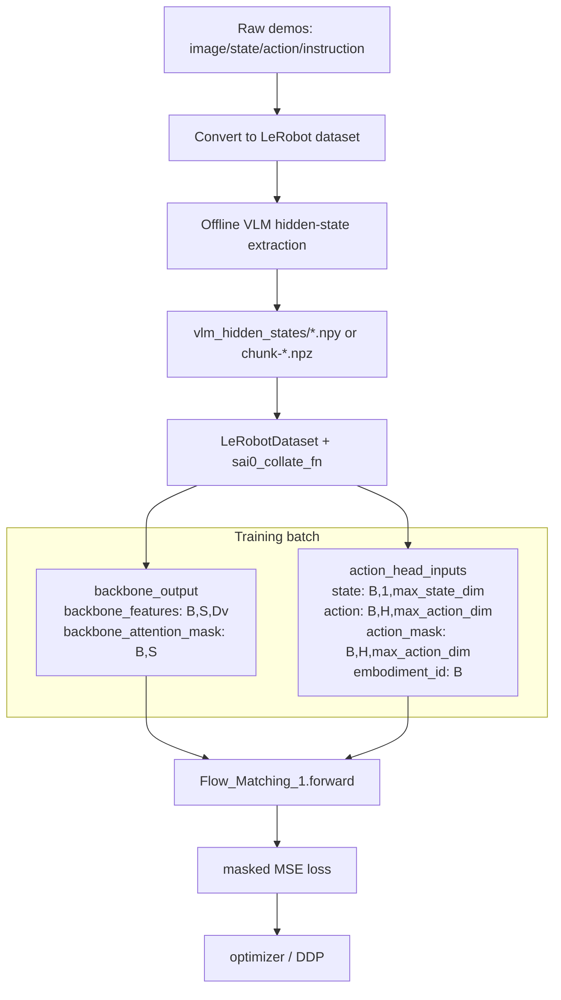
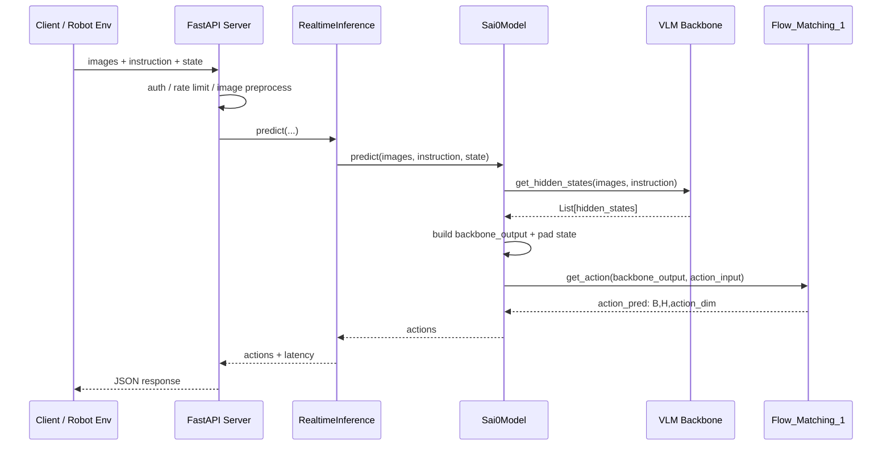
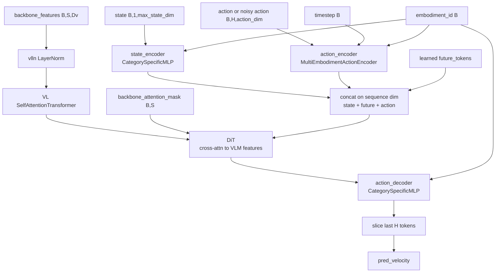
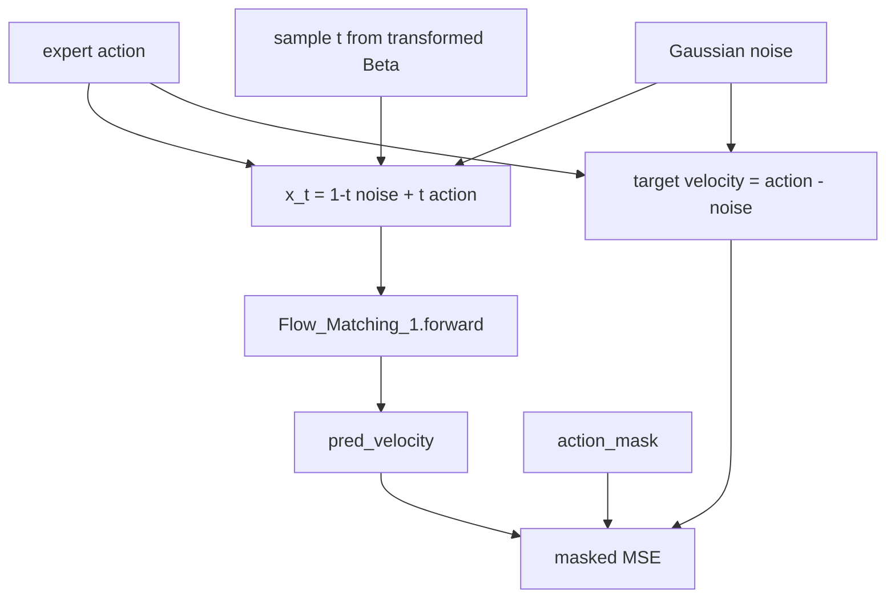
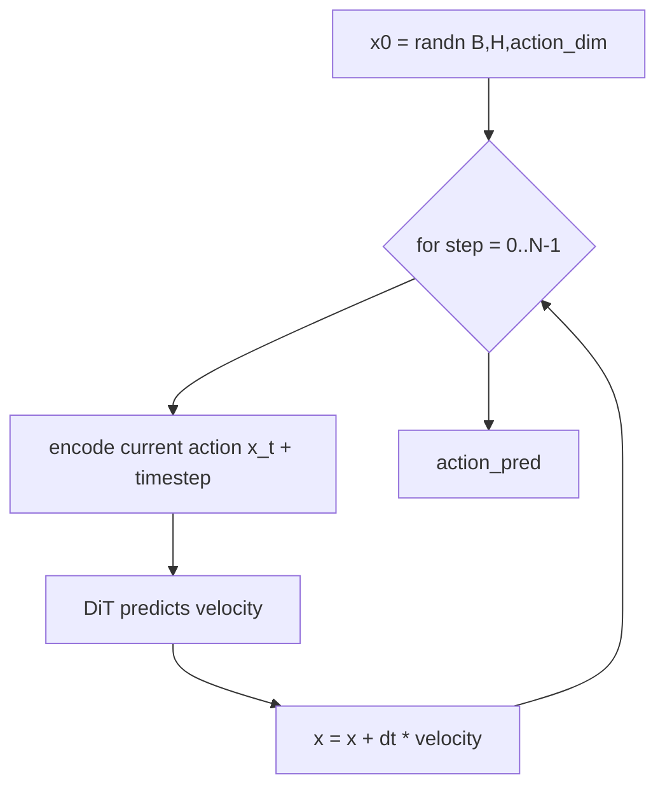
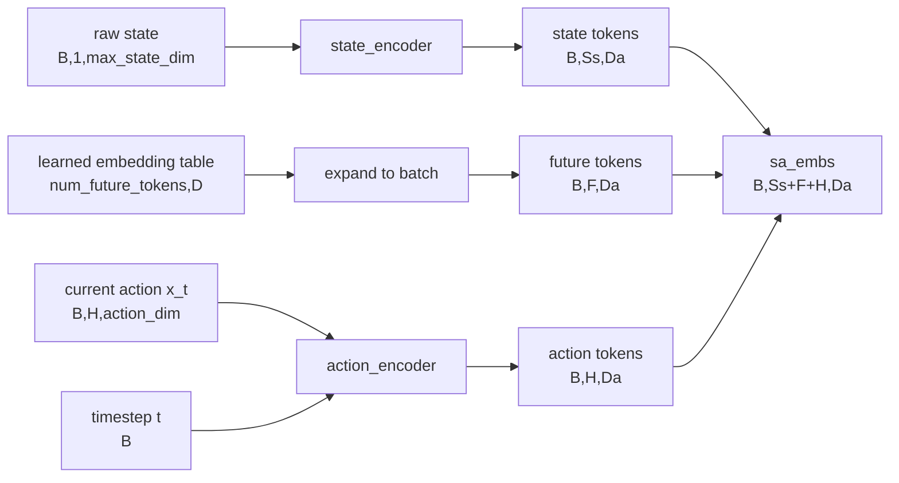
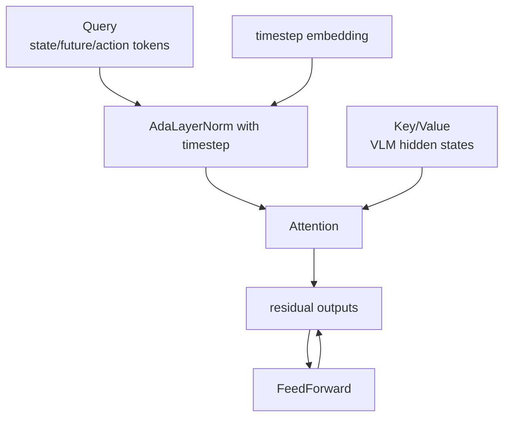
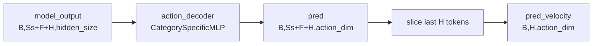
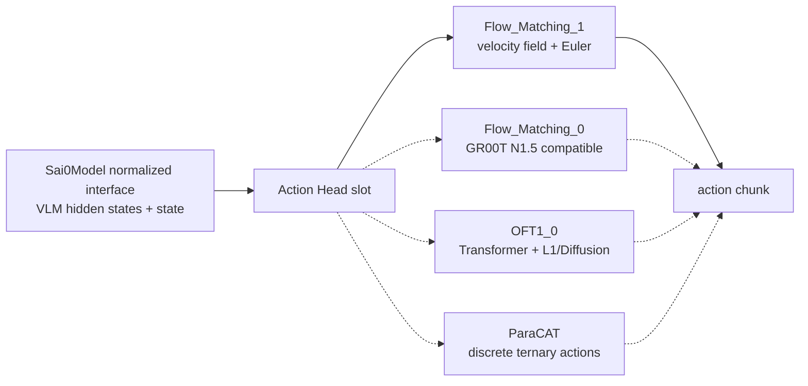

# Sai0-VLA System Architecture Design

This document maps the end-to-end Sai0-VLA system, the training and inference data flow, and the internal algorithm/data flow of the recommended `Flow_Matching_1` action head.

Main path:

```text
VLMs/S0_1 + VLAs/Sai0_1 + Action_Heads/Flow_Matching_1
```

`Flow_Matching_0`, `OFT1_0`, and `ParaCAT` are alternative implementations of the Action Head slot.

---

## 1. System Goal

Input:

```text
multi-view images + language instruction + current robot state
```

Output:

```text
future H-step action chunk: (H, action_dim)
```

Core idea:

```text
Frozen VLM extracts visual-language semantics.
Trainable Action Head decodes VLM hidden states + robot state into robot actions.
Sai0_1 wraps both sides into one training/inference interface.
```

---

## 2. System-Level Module View



---

## 3. Training Data Flow

Training usually uses pre-extracted VLM hidden states. The VLM is not repeatedly run during Action Head training.



The `action` field in the training batch is the expert action from demonstrations. The collate function slices it into a future `H`-step action chunk and pads it to `max_action_dim`.

---

## 4. Realtime Inference Flow

Realtime inference does not use cached hidden states. `Sai0Model.predict` calls the VLM online.



---

## 5. Key Data Structures

| Name | Typical shape | Source | Meaning |
|---|---:|---|---|
| `images` | multi-view PIL/array | env or dataset | agentview, wrist, etc. |
| `instruction` | string | task | natural-language task instruction |
| `vlm_hidden_states` | `(B,L,S,Dv)` or list | VLM | visual-language tokens from selected layers |
| `backbone_features` | `(B,S,Dv)` | collate or online VLM | layer/merged features consumed by Action Head |
| `state` | `(B,1,max_state_dim)` | dataset/env | current robot proprio state after padding |
| `action` | `(B,H,max_action_dim)` | dataset | expert action chunk, only used in training |
| `action_mask` | `(B,H,max_action_dim)` | collate | masks real action dims and ignores padding |
| `embodiment_id` | `(B,)` | collate/config | selects embodiment-specific parameters |
| `action_pred` | `(B,H,action_dim)` | Action Head | predicted action chunk |

---

## 6. `Flow_Matching_1` Internal Overview

Core files:

```text
Action_Heads/Flow_Matching_1/models/action_head/flow_matching_action_head.py
Action_Heads/Flow_Matching_1/models/action_head/cross_attention_dit.py
```



---

## 7. Flow Matching Algorithm Flow

### 7.1 Training Algorithm



Linear flow means the path from random action noise to expert action is a straight interpolation:

```text
x_t = (1 - t) * noise + t * action
velocity = d x_t / dt = action - noise
```

The model learns this conditional velocity field:

```text
v_theta(x_t, t, VLM hidden states, state) ~= action - noise
```

### 7.2 Inference Algorithm



Default `num_inference_timesteps=4`, so inference performs four Euler updates.

---

## 8. Token-Level Data Flow

The central path is:

```text
state tokens + future tokens + action tokens
  -> DiT cross-attend VLM hidden states
  -> action_decoder
  -> pred_velocity
```

### 8.1 Token Composition



| Token | Source | Role |
|---|---|---|
| `state tokens` | `state_encoder(state, embodiment_id)` | robot body context: gripper, pose, joints, etc. |
| `future tokens` | learned embedding | planning workspace for future context and intermediate computation |
| `action tokens` | `action_encoder(x_t, t, embodiment_id)` | current action chunk being refined, one token per future step |

### 8.2 `state_encoder`

`state_encoder` is a `CategorySpecificMLP`:

```text
state: B,1,max_state_dim
embodiment_id: B
  -> select W/b for this embodiment
  -> Linear(max_state_dim -> hidden_size)
  -> ReLU
  -> Linear(hidden_size -> input_embedding_dim)
  -> state_features: B,1,input_embedding_dim
```

`CategorySpecific` means different robots can use different linear parameters selected by `embodiment_id`.

### 8.3 `action_encoder`

`action_encoder` is a `MultiEmbodimentActionEncoder`:

```text
x_t: B,H,action_dim
t: B
embodiment_id: B
  -> W1: action_dim -> input_embedding_dim
  -> sinusoidal timestep embedding: B,H,input_embedding_dim
  -> concat(action_emb, time_emb): B,H,2*input_embedding_dim
  -> W2 + swish
  -> W3
  -> action_features: B,H,input_embedding_dim
```

Each action token therefore encodes the current action value, the flow time, and the robot embodiment.

### 8.4 DiT Cross-Attention



Inside DiT:

```text
hidden_states = state/future/action tokens
encoder_hidden_states = VLM hidden states
timestep = flow time
```

Cross-attention means action-side tokens query the visual-language tokens. Action tokens can attend to target object locations, state tokens can attend to the relation between robot pose and the scene, and future tokens provide extra planning capacity.

DiT output has the same sequence length:

```text
model_output: B,Ss+F+H,hidden_size
```

### 8.5 `action_decoder` and `pred_velocity`



The concatenation order is:

```text
[state tokens][future tokens][action tokens]
```

So the last `H` tokens correspond to the future action chunk. The head keeps only those outputs:

```text
pred_velocity = pred[:, -action_horizon:]
```

---

## 9. Module Responsibility Table

| Module | File | Input | Output | Responsibility |
|---|---|---|---|---|
| VLM factory | `VLMs/S0_1/backbone/model_selector.py` | model type/path/layers | VLM backbone | load Qwen/Eagle/Cosmos by config |
| VLM backbone | `VLMs/S0_1/backbone/*/backbone.py` | images + instruction | hidden states list | extract visual-language tokens |
| Sai0Model | `VLAs/Sai0_1/sai0_model.py` | config / hidden states / state | loss or actions | orchestrate VLM and Action Head |
| data collate | `VLAs/Sai0_1/data_utils.py` | LeRobot samples | BatchFeature pair | normalize, pad, mask, batch |
| FlowMatching Head | `Action_Heads/Flow_Matching_1/.../flow_matching_action_head.py` | backbone_output + action_input | loss or action_pred | learn action velocity field |
| DiT | `Action_Heads/Flow_Matching_1/.../cross_attention_dit.py` | state/future/action tokens + VLM tokens + t | updated tokens | conditional Transformer action modeling |
| deployment server | `deployment/Sai0_1_server/server.py` | HTTP JSON/images | JSON actions | served inference, auth, rate limit, queue |

---

## 10. Replaceable Action Head Boundary



Stable inference-side interface:

```text
backbone_features + backbone_attention_mask + state + embodiment_id
```

Training adds:

```text
action + action_mask
```

Any new Action Head can plug into `Sai0_1` if it consumes these tensors and returns either `loss` for training or `action_pred` for inference.
