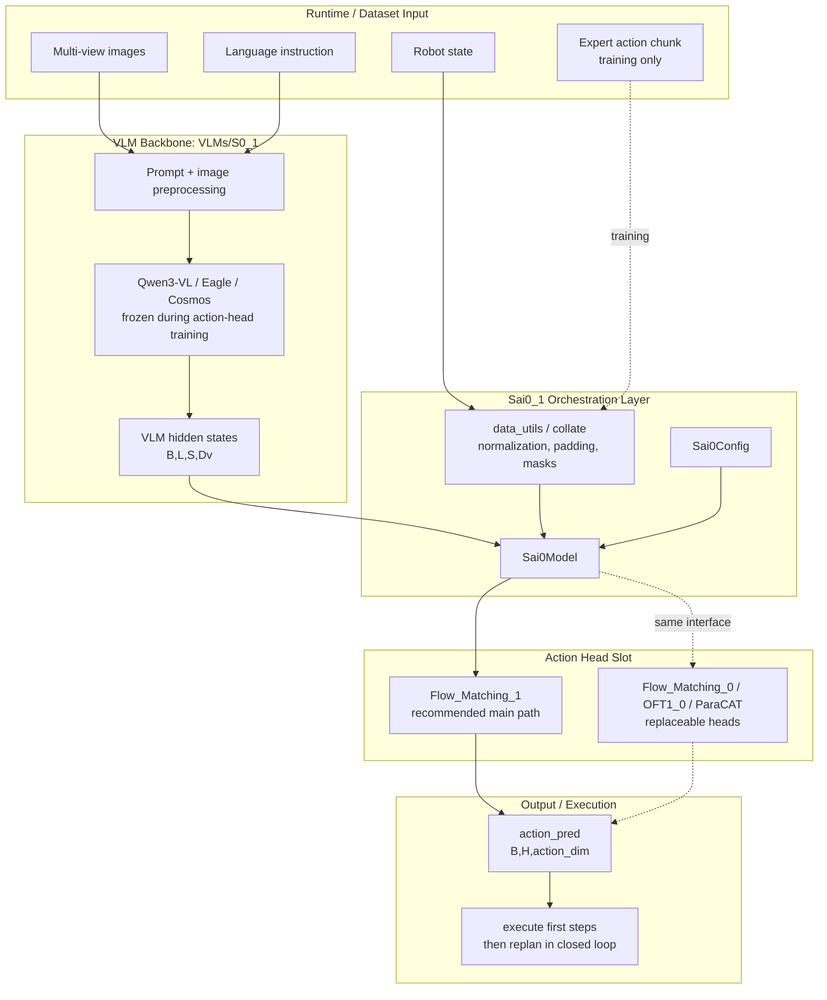
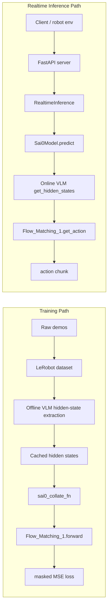
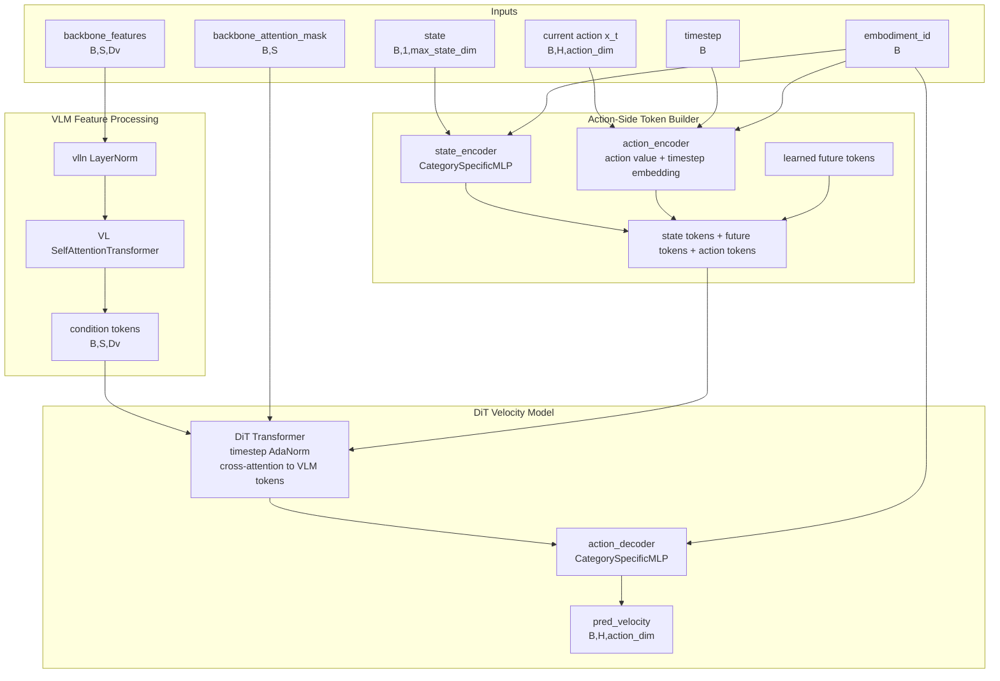
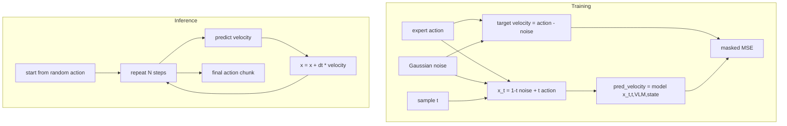
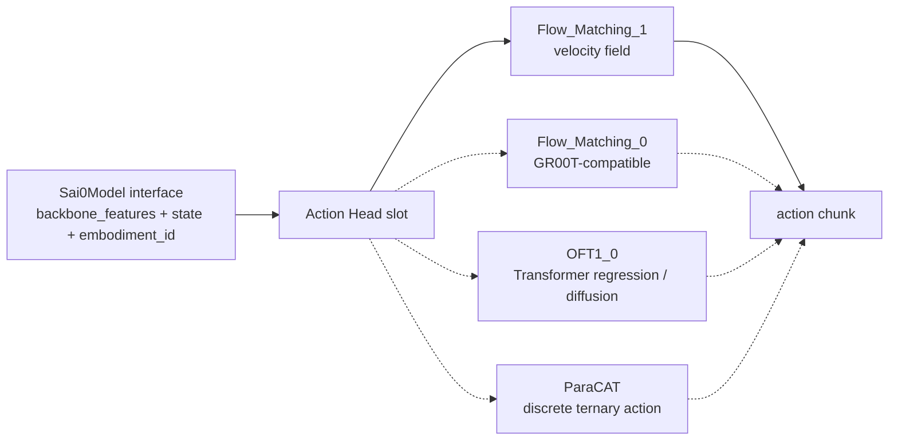

# Sai0-VLA System Architecture Compact View

这是一份更适合阅读和讲解的架构版文档。它不替代
`SYSTEM_ARCHITECTURE.md`，而是把原文里分散的图和表压缩成几个主图，并用分节说明替代表格。

主线：

```text
images + instruction + state
  -> VLM hidden states
  -> Action Head
  -> future action chunk
```

---

## 1. End-to-End System



### Module Notes

**VLM Backbone**

负责把图像和语言指令编码成视觉语言 token。训练 Action Head 时通常冻结 VLM，并提前离线保存 hidden states，避免训练时反复跑大模型。

Typical output:

```text
vlm_hidden_states: (B, L, S, Dv)
backbone_features: (B, S, Dv)
```

**Sai0_1 Orchestration Layer**

负责统一配置、加载 VLM、加载 Action Head、组织训练 batch 和实时推理输入。核心文件是：

```text
VLAs/Sai0_1/config.py
VLAs/Sai0_1/sai0_model.py
VLAs/Sai0_1/data_utils.py
```

**Action Head Slot**

负责把 `backbone_features + state` 解码成动作。主力路径是 `Flow_Matching_1`，其他 head 可以替换这个位置。

---

## 2. Training vs Inference Flow



### Training Path

1. 原始演示数据被转换成 LeRobot 格式。
2. VLM 对图像和指令离线提取 hidden states。
3. dataloader 读取 hidden states、state、expert action chunk。
4. `sai0_collate_fn` 做归一化、padding、mask 构造。
5. `Flow_Matching_1.forward` 构造 noisy action，并预测 velocity。
6. loss 是 `pred_velocity` 和 `action - noise` 的 masked MSE。

Training tensors:

```text
backbone_features:       (B, S, Dv)
backbone_attention_mask: (B, S)
state:                   (B, 1, max_state_dim)
action:                  (B, H, max_action_dim)
action_mask:             (B, H, max_action_dim)
embodiment_id:           (B,)
```

### Inference Path

1. 服务收到图像、指令、state。
2. `Sai0Model.predict` 在线调用 VLM。
3. 当前 state 被 padding 成 action head 需要的格式。
4. `Flow_Matching_1.get_action` 从随机动作开始做多步 Euler 更新。
5. 输出未来 `H` 步 action chunk。

Inference tensors:

```text
backbone_features:       (B, S, Dv)
backbone_attention_mask: (B, S)
state:                   (B, 1, max_state_dim)
embodiment_id:           (B,)
action_pred:             (B, H, action_dim)
```

---

## 3. Flow_Matching_1 Inner Architecture



### `state_encoder`

Purpose:

```text
low-dimensional robot state -> transformer token
```

Algorithm:

```text
state + embodiment_id
  -> select embodiment-specific weights
  -> Linear(max_state_dim -> hidden_size)
  -> ReLU
  -> Linear(hidden_size -> input_embedding_dim)
  -> state token
```

The `embodiment_id` allows different robot bodies to use different projection weights.

### `action_encoder`

Purpose:

```text
current noisy action trajectory + flow timestep -> action tokens
```

Algorithm:

```text
x_t: B,H,action_dim
t:   B

action value -> W1 -> action embedding
timestep     -> sinusoidal encoding -> time embedding
[action embedding, time embedding] -> W2 -> swish -> W3
```

Each future step in the action chunk becomes one action token.

### `future_tokens`

These are learned tokens, not directly from input data. They act as extra planning workspace between state/action tokens and VLM context.

### DiT

DiT means Diffusion Transformer. In this repo it is used as a conditional transformer for action velocity prediction.

It receives:

```text
hidden_states = state/future/action tokens
encoder_hidden_states = VLM hidden states
timestep = flow timestep
```

Its cross-attention means:

```text
action-side tokens query VLM tokens
```

So action tokens can read visual-language context such as target object, spatial relation, and task instruction.

### `action_decoder`

The decoder maps DiT output tokens back to action dimension. Since token order is:

```text
[state tokens][future tokens][action tokens]
```

the head keeps only the last `H` outputs:

```text
pred_velocity = pred[:, -action_horizon:]
```

---

## 4. Flow Matching Algorithm



### Linear Flow

The path from random action noise to expert action is a straight line:

```text
x_t = (1 - t) * noise + t * action
```

The target velocity is constant along that line:

```text
velocity = action - noise
```

The model learns:

```text
v_theta(x_t, t, VLM hidden states, state) ~= action - noise
```

### Inference

At inference time there is no expert action. The model starts from random action and repeatedly applies the learned velocity field:

```text
x_0 = random action
x_{k+1} = x_k + dt * v_theta(x_k, t, VLM hidden states, state)
```

Default:

```text
num_inference_timesteps = 4
```

---

## 5. Replaceable Action Head Boundary



Inference-side stable inputs:

```text
backbone_features
backbone_attention_mask
state
embodiment_id
```

Training adds:

```text
action
action_mask
```

That is the boundary a new Action Head must satisfy to plug into `VLAs/Sai0_1`.

